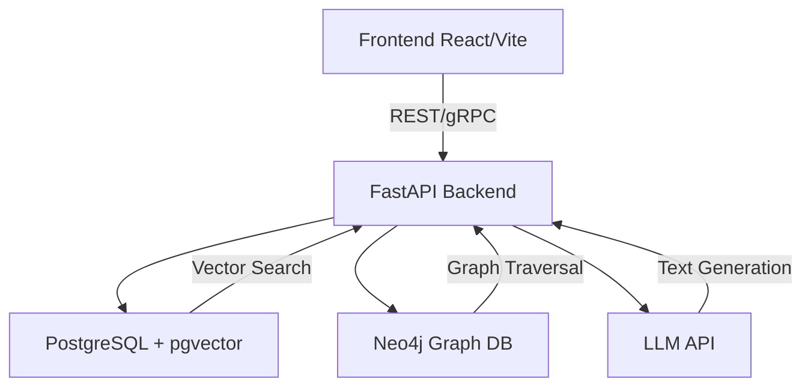

# KNOWFLOW


KnowFlow is a powerful hybrid Retrieval-Augmented Generation (RAG) system that combines semantic search with knowledge graph capabilities for intelligent document processing and querying.

## 🌟 Features

- **Hybrid RAG + Knowledge Graph Architecture**

  - Dense semantic embeddings via vector DB (PostgreSQL + pgvector)
  - Structured graph traversal using Neo4j
  - Multi-hop reasoning over connected concepts
  - Explainable results through graph node tracing

- **Advanced Document Processing**

  - Intelligent document chunking and indexing
  - Hierarchical document structure preservation
  - Cross-document relationship mapping
  - Support for multiple file formats

- **Smart Query Processing**

  - Named Entity Recognition for query understanding
  - Combined vector and graph-based retrieval
  - Context-aware response generation
  - Conversation memory with graph context

- **Enterprise-Ready**
  - Role-based access control
  - Secure authentication
  - API-first architecture
  - Comprehensive monitoring

## 🏗️ Architecture



## 🚀 Quick Start

### Prerequisites

- Docker Engine 24.0+
- Docker Compose v2.0+
- 16GB RAM minimum
- 50GB free disk space

### Development Setup

1. Clone the repository:

```bash
git clone https://github.com/yourusername/knowflow.git
cd knowflow
```

2. Create a `.env` file:

```env
POSTGRES_PASSWORD=secure_password
POSTGRES_DB=knowflow
POSTGRES_USER=knowflow
NEO4J_PASSWORD=secure_password
GROQ_API_KEY=your_groq_api_key
APP_ENV=development
LOG_LEVEL=INFO
```

3. Start the development environment:

```bash
docker compose -f docker/development/docker-compose.yml up -d
```

4. Access the services:

- Frontend: http://localhost:3000
- API Docs: http://localhost:8000/docs
- Neo4j Browser: http://localhost:7474
- Grafana: http://localhost:3000

## 📚 Documentation

- [API Documentation](docs/API.md)
- [AI Architecture](docs/AI-ARCHITECTURE.md)
- [Deployment Guide](docs/DEPLOYMENT.md)
- [Docker Setup](docs/DOCKER.md)

## 🛠️ Tech Stack

- **Frontend**: React + Vite
- **Backend**: FastAPI
- **Vector Store**: PostgreSQL + pgvector
- **Graph Database**: Neo4j
- **LLM Integration**: Groq API
- **Storage**: S3 / PostgreSQL
- **Monitoring**: Grafana / Prometheus

## 🔒 Security

- JWT-based authentication
- Role-based access control
- Secure password hashing
- Rate limiting
- Encrypted data at rest
- Regular security audits

## 📊 Monitoring & Analytics

- Request latency tracking
- Endpoint usage metrics
- Error rate monitoring
- User engagement analytics
- System health monitoring
- LLM usage tracking

## 🤝 Contributing

1. Fork the repository
2. Create a feature branch
3. Commit your changes
4. Push to the branch
5. Create a Pull Request

## 📄 License

This project is licensed under the terms of the LICENSE file included in the repository.

## 🌐 Community & Support

- [Issue Tracker](https://github.com/yourusername/knowflow/issues)
- [Documentation](docs/)
- [Project Roadmap](docs/PRD.md)
