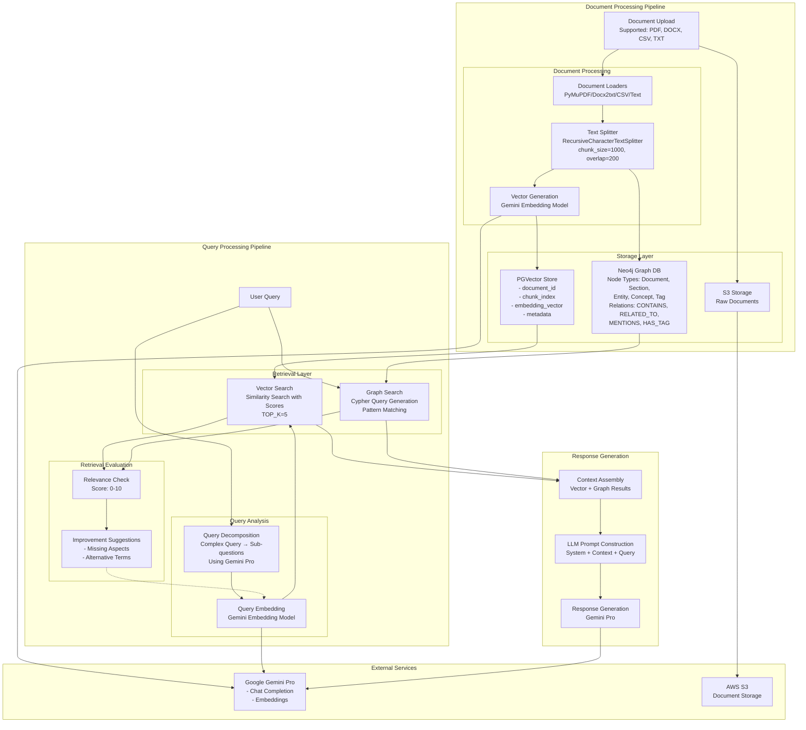

# KnowFlow Technical Architecture

## Document Processing Pipeline

### 1. Document Upload & Initial Processing

- **Supported Formats**: PDF, DOCX, CSV, TXT
- **Document Loaders**:
  - PDF: `PyMuPDFLoader`
  - DOCX: `Docx2txtLoader`
  - CSV: `CSVLoader`
  - TXT: `TextLoader`
  - Fallback: `UnstructuredFileLoader`

### 2. Text Processing

- **Text Splitter**: `RecursiveCharacterTextSplitter`
  ```python
  text_splitter = RecursiveCharacterTextSplitter(
      chunk_size=1000,
      chunk_overlap=200,
      separators=["\n\n", "\n", " ", ""],
      keep_separator=True
  )
  ```

### 3. Vector Generation

- **Embedding Model**: Gemini Embedding Model
- **Vector Store**: PGVector (PostgreSQL)
  ```python
  vector_store = PGVector(
      connection=DATABASE_URL,
      embeddings=embeddings,
      collection_name=VECTOR_COLLECTION_NAME
  )
  ```

### 4. Knowledge Graph Construction

- **Database**: Neo4j
- **Node Types**:
  - Document: Main document node
  - Section: Document sections
  - Entity: Named entities
  - Concept: Key ideas/terms
  - Tag: Categories
- **Relationship Types**:
  - CONTAINS: Hierarchy
  - RELATED_TO: General connections
  - MENTIONS: References
  - HAS_TAG: Classifications

## Query Processing Pipeline

### 1. Query Analysis

- **Query Decomposition**:
  ```python
  messages = [
      SystemMessage(content="Query decomposition prompt"),
      HumanMessage(content=query)
  ]
  sub_questions = llm.invoke(messages)
  ```

### 2. Retrieval Process

- **Vector Search**:
  ```python
  docs_and_scores = vector_store.similarity_search_with_score_by_vector(
      embedding=query_embedding,
      k=TOP_K_RESULTS,
      filter=filter_dict
  )
  ```
- **Graph Search**:
  - Cypher query generation
  - Pattern matching
  - Context retrieval

### 3. Retrieval Evaluation

- **Quality Metrics**:
  ```json
  {
      "chunk_scores": [
          {"chunk": "text", "relevance_score": 0-10, "reasoning": "explanation"}
      ],
      "missing_aspects": ["list of missing information"],
      "redundant_information": ["list of redundancies"],
      "suggested_improvements": {
          "additional_info_needed": ["missing info"],
          "alternative_search_terms": ["suggested terms"]
      },
      "overall_quality_score": 0-10
  }
  ```

### 4. Response Generation

- **Context Assembly**:

  ```python
  def _merge_results(vector_results, graph_results):
      graph_texts = []
      for result in graph_results:
          text = f"Type: {result.get('type')}\n"
          text += f"Properties: {result.get('properties')}\n"
          text += f"Relationships: {result.get('relationships')}"
          graph_texts.append(text)

      all_texts = vector_results[:3] + graph_texts[:3]
      return "\n\n".join(all_texts)
  ```

- **LLM Prompt Structure**:
  ```python
  system_prompt = f"""
  You are a helpful, reasoning assistant. Answer based on:
  Context: {context}
  Guidelines:
  - Rephrase/summarize from context
  - Use reasoning to clarify
  - No fabrication
  - Indicate if answer unavailable
  """
  ```

## Storage Architecture

### 1. Vector Store (PostgreSQL)

- **Schema**:
  ```sql
  CREATE TABLE document_chunks (
      id SERIAL PRIMARY KEY,
      document_id INTEGER,
      chunk_index INTEGER,
      content TEXT,
      embedding_vector vector(768),
      metadata JSONB
  );
  ```

### 2. Graph Database (Neo4j)

- **Node Properties**:
  ```json
  {
    "id": "unique_id",
    "type": "node_type",
    "name": "node_name",
    "content": "text_content",
    "created_at": "timestamp"
  }
  ```
- **Relationship Properties**:
  ```json
  {
      "type": "relationship_type",
      "context": "relationship_context",
      "confidence": 0.0-1.0,
      "created_at": "timestamp"
  }
  ```

### 3. Document Storage (S3)

- **Structure**:
  ```
  s3://bucket/
    └── users/
        └── {user_id}/
            └── documents/
                └── {doc_id}.{extension}
  ```

## Mermaid Technical Flowchart


