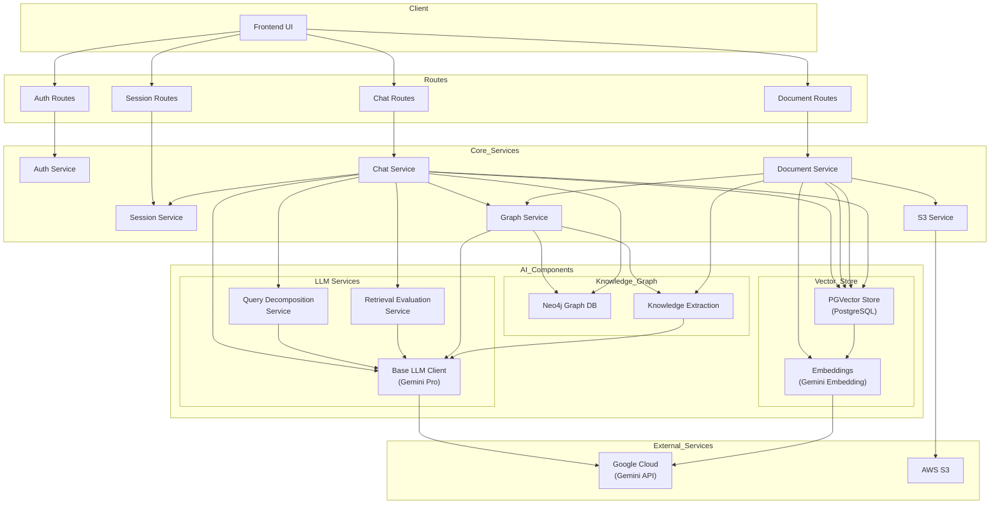

# KnowFlow System Architecture

## Overview

KnowFlow is an AI-powered knowledge management system that combines multiple advanced components to provide intelligent document processing, chat interactions, and knowledge retrieval.

## System Components

### 1. Client Layer

- **Frontend UI**: User interface for interacting with the system

### 2. Routes Layer

- **Auth Routes**: Authentication and user management endpoints
- **Chat Routes**: Chat interaction endpoints
- **Document Routes**: Document processing endpoints
- **Session Routes**: Chat session management endpoints

### 3. Core Services

- **Auth Service**: User authentication and authorization
- **Chat Service**: Main chat processing and orchestration
- **Document Service**: Document processing and indexing
- **Session Service**: Chat session management
- **Graph Service**: Knowledge graph operations
- **S3 Service**: File storage management

### 4. AI Components

#### LLM Services

- **Base LLM Client**: Gemini Pro integration for natural language processing
- **Query Decomposition**: Breaks complex queries into manageable sub-questions
- **Retrieval Evaluation**: Evaluates and improves retrieval quality

#### Vector Store

- **PGVector Store**: PostgreSQL-based vector storage for semantic search
- **Embeddings**: Gemini Embedding model for document vectorization

#### Knowledge Graph

- **Neo4j Graph DB**: Graph database for structured knowledge
- **Knowledge Extraction**: Converts text to graph structures

### 5. External Services

- **Google Cloud (Gemini API)**: Powers LLM and embedding operations
- **AWS S3**: Document storage

## Key Flows

### 1. Document Processing Flow

1. Documents uploaded through Document Routes
2. Document Service processes them
3. Raw content stored in S3
4. Embeddings generated and stored in PGVector
5. Knowledge extracted and stored in Neo4j

### 2. Chat Flow

1. User query received via Chat Routes
2. Chat Service orchestrates:
   - Query decomposition for complex queries
   - Vector search for relevant content
   - Knowledge graph querying
   - Retrieval evaluation and improvement
   - LLM response generation

### 3. AI Processing Flow

- Base LLM Client manages all Gemini API interactions
- Query Decomposition handles complex queries
- Retrieval Evaluation ensures response quality
- Knowledge Graph maintains structured information
- Vector Store enables semantic search

## Mermaid Diagram

## System Features

1. **Intelligent Document Processing**

   - Automatic content extraction
   - Semantic embedding generation
   - Knowledge graph construction
   - Structured storage

2. **Advanced Query Processing**

   - Query decomposition for complex questions
   - Multi-source information retrieval
   - Quality evaluation and improvement
   - Context-aware responses

3. **Knowledge Management**

   - Semantic search capabilities
   - Structured knowledge representation
   - Relationship mapping
   - Context preservation

4. **Security & Organization**
   - User authentication and authorization
   - Session management
   - Secure file storage
   - Access control
